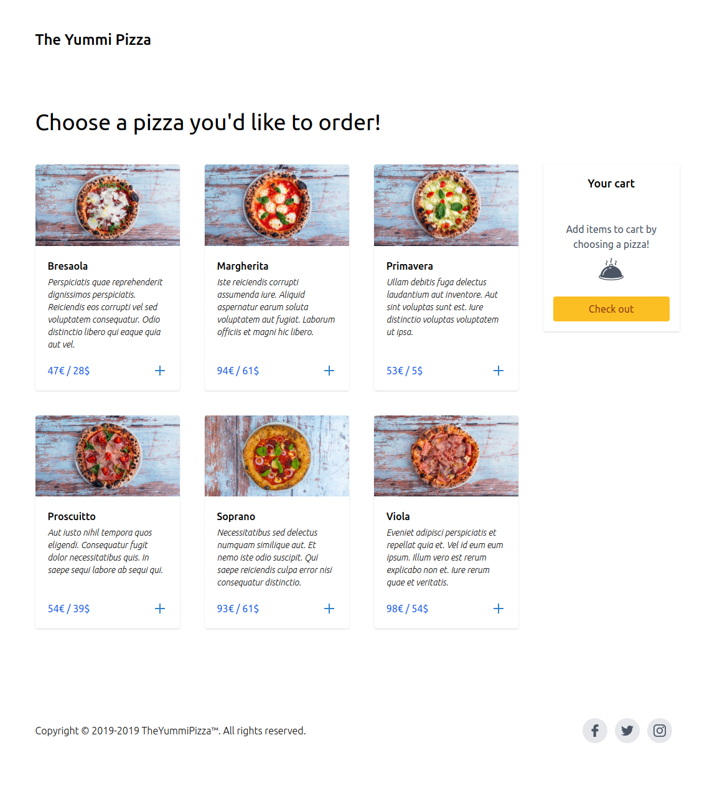

# The Yummi Pizza

Coding challenge for a company I aplied for.

## Screenshots

### Front page



### Ordering modal


## Task description

Create a web application for ordering pizza for your clients, which contains a
shopping cart. Take the pizza order and the delivery address and contact details
for the client. Login is not required but could be available for checking the
history of orders.

## Requirements

- Your clients should be able to order pizzas from the menu
- The menu contains at least 6 pizzas
- You can decide what else you want in the menu
- Processing order/etc. with payment is NOT required. Concentrate on the
  interface to your pizza customer up to the point the customer confirms his
  order.
- The pizza order process should cover ordering single or several pizzas with
  definition of the quantity and calucation of a total price in euro and
  dollars, also adding delivery costs to the bill.

## Technology used

- Frontend – ReactJS
- Backend – Laravel
- Database – MySQL
- CSS - Tailwind

## API Routes

- **/pizzas**
  - GET - returns all available pizzas
- **/customers**
  - GET - returns all customers
  - POST - add a customer
- **/orders**
  - GET - returns all orders
  - POST - add an order

## Installation

Clone this repo, and run the next commands:

1. First install all of the packages used

```bash
composer install
npm install
```

2. Create your own `.env` file

```bash
cp .env.example .env
```

3. Generate Laravel application key

```bash
php artisan key:generate
```

4. This project is using Laravel with docker. Use `sail` script from composer to
   create docker container

```bash
./vendor/bin/sail up -d
```

5. Run database migrations and seed your database

```bash
./vendor/bin/sail artisan migrate:refresh --seed
```

6. Finally, run your script start your React app in the container

```bash
./vendor/bin/sail npm run watch
```

## License

The project is open-sourced software licensed under the [MIT](./LICENSE) license.
